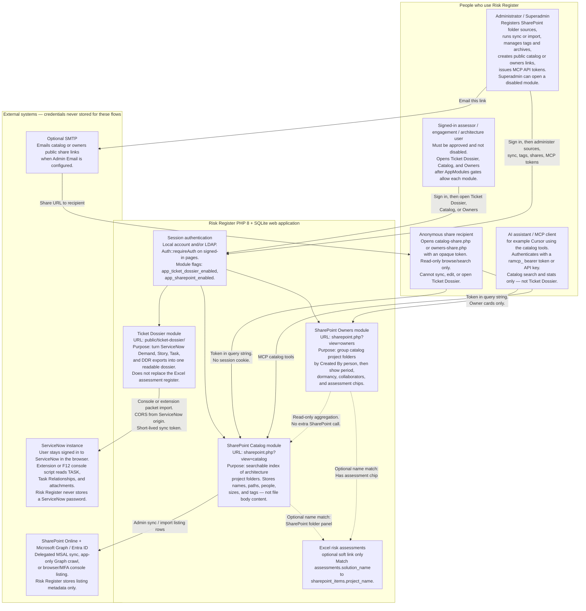
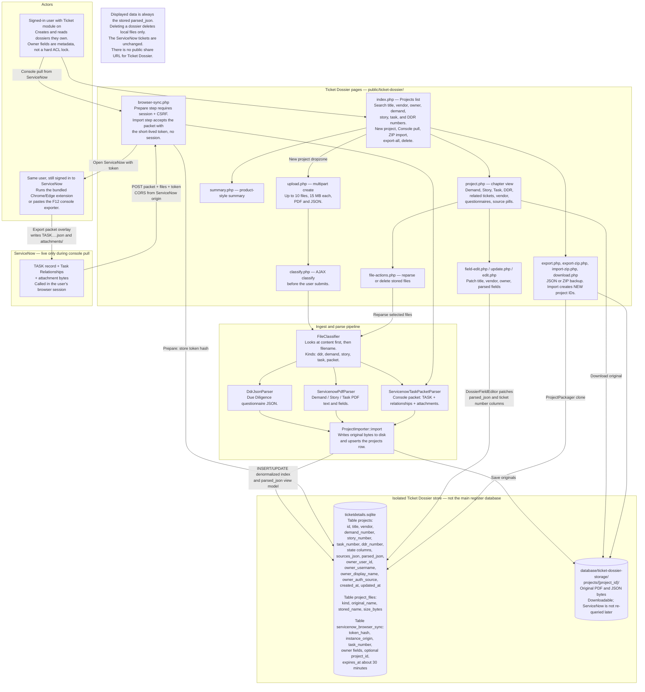
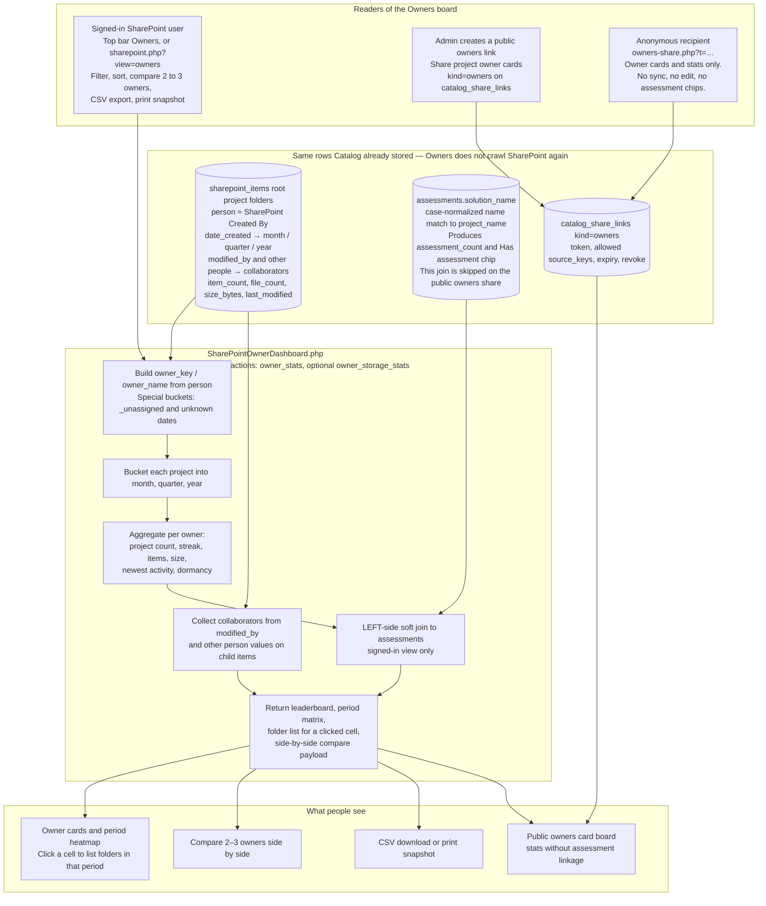
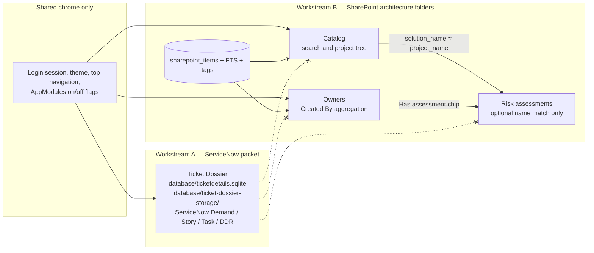
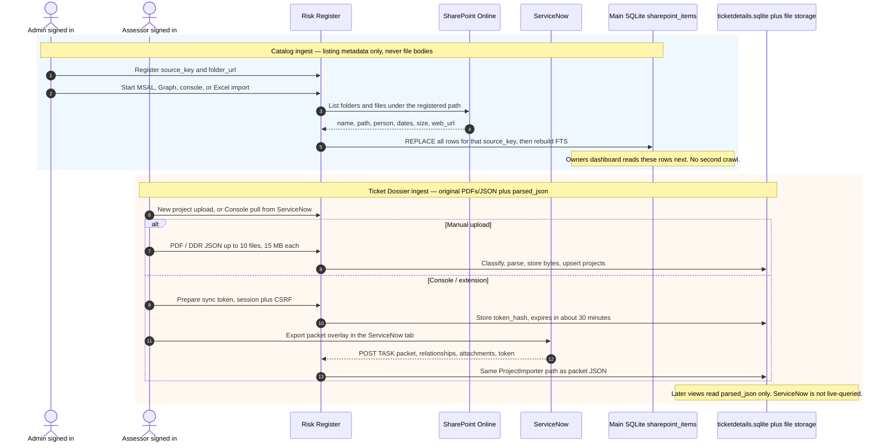

# Risk Register data flow diagrams

Mermaid source for Ticket Dossier, SharePoint Catalog, and SharePoint Owners. Copy each fenced `mermaid` block into Mermaid Live, mermaid-cli, or an imaging app.

**Relationship in one sentence:** Catalog is the searchable SharePoint listing; Owners is a read model over the same `person` and date fields; Ticket Dossier is a signed-in ServiceNow packet viewer on its own SQLite file and has no public share and no SharePoint foreign key.

Ticket Dossier is a **separate ServiceNow packet store**. SharePoint Catalog and SharePoint Owners are **two views of the same SharePoint index**. They share login and navigation, but dossier records never join catalog folders.

If you want a single combined poster, start with diagram **1**, then drop **2**, **3**, and **4** as swimlanes under it.

---

## 1. Context diagram — who uses what, and which systems sit outside the app



---

## 2. Ticket Dossier — detailed data flow



---

## 3. SharePoint Catalog — detailed data flow

```mermaid
flowchart TB
    subgraph WHO["Who feeds and who reads the catalog"]
        Admin["Admin registers a source<br/>source_key, title, folder_url,<br/>site_host, site_path, folder_path"]
        User["Signed-in user<br/>Search, open project dialog,<br/>favorites, QR / copy SharePoint URL"]
        Public["Public catalog share holder<br/>catalog-share.php?t=…<br/>Allowed source_keys only"]
        MCP["MCP client<br/>public/api/mcp.php<br/>search, list projects, get project,<br/>list sources, tags, stats"]
    end

    subgraph INGEST["Four admin ingest paths — each REPLACE-all for that source_key"]
        MSAL["One-click Sync MSAL<br/>Entra SPA Client ID + Tenant ID<br/>Delegated Graph Sites.Read.All"]
        Graph["App-only Graph crawl<br/>Client secret + application Sites.Read.All<br/>SharePointGraphClient"]
        Console["Browser / MFA console sync<br/>Prepare token on the source,<br/>run script in the SharePoint tab,<br/>POST rows to action=browser_sync_import<br/>before session auth, CORS from SharePoint origin"]
        Excel["Excel or CSV listing import<br/>SharePointListingImporter<br/>or PowerShell Export-SharePointCatalog.ps1"]
    end

    subgraph SP["SharePoint Online library root<br/>Architecture project folders under the registered path"]
        Lib["Folder listing: name, relative_path,<br/>item_type file or folder, mime_type,<br/>size_bytes, last_modified, date_created,<br/>modified_by, Created By person, web_url"]
    end

    subgraph PROC["Catalog processing on the server"]
        Imp["Importer writes rows then rebuilds FTS<br/>REPLACE FROM sharepoint_items WHERE source_key = ?<br/>then refresh sharepoint_items_fts"]
        Qry["SharePointCatalogQuery<br/>Operators: tag: ext: person: path: has:<br/>quoted phrase, -exclude, fuzzy / deep,<br/>AND or OR mode"]
        Cmp["SharePointCatalogComparer<br/>Diff two sources or snapshots"]
        Soft["SharePointCatalogRepository<br/>findMatchingProjectAnySource(solution_name)<br/>soft-links the assessment dashboard"]
    end

    subgraph DATA[("Main app SQLite — shared by Catalog and Owners<br/>NOT ticketdetails.sqlite")]
        Src["sharepoint_sources<br/>Registered folder roots and sync status,<br/>sync_token_hash / expiry, sort_order"]
        Items["sharepoint_items<br/>source_key + item_key unique,<br/>parent_item_key, project_name,<br/>name, item_type, relative_path, web_url,<br/>mime_type, size_bytes, last_modified,<br/>date_created, modified_by, person, synced_at"]
        FTS["sharepoint_items_fts FTS5<br/>Search mirror of name, path, people, project"]
        Tags["sharepoint_search_tags<br/>+ sharepoint_search_tag_assignments<br/>Keyed by source_key, scope project or item,<br/>project_name, relative_path — survive resync"]
        Arch["sharepoint_archives<br/>Hide source / project / path from default search"]
        Fav["user_catalog_favorites<br/>Per signed-in user"]
        Share["catalog_share_links kind=catalog<br/>token_hash, source_keys JSON,<br/>label, revoke, expiry, audit"]
    end

    subgraph UI["What the catalog displays — metadata only, never file bodies"]
        Hub["sharepoint.php hub<br/>Folders + search + admin panels"]
        Cards["Project cards / table<br/>Nested file tree, people, sizes,<br/>match highlights, SharePoint deep links, QR"]
        Assess["Assessment dashboard<br/>SharePoint folder panel when names match"]
    end

    Admin --> Src
    Admin --> MSAL
    Admin --> Graph
    Admin --> Console
    Admin --> Excel
    MSAL --> Lib
    Graph --> Lib
    Console --> Lib
    Excel --> Lib
    Lib --> Imp
    Imp --> Items
    Imp --> FTS
    User --> Hub
    Hub --> Qry
    Qry --> FTS
    Qry --> Items
    Qry --> Tags
    Qry --> Arch
    Hub --> Cards
    User --> Fav
    Admin --> Tags
    Admin --> Arch
    Admin --> Share
    Public --> Share
    Public --> Qry
    MCP --> Qry
    Hub --> Cmp
    Items --> Soft
    Soft --> Assess
```

---

## 4. SharePoint Owners — detailed data flow



---

## 5. How the three modules relate — and what they do not share



---

## 6. Sequence — Catalog sync versus Dossier console pull

These two ingest paths look similar (browser token, CORS, no stored password) but they write to **different databases**.


